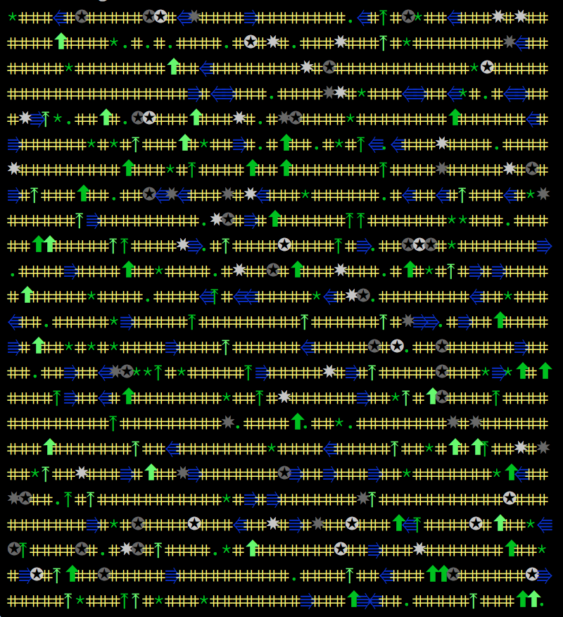

<pre>
 _____           _     _       
|     |___ ___ _| |___|_|_____ 
|  |  |   | . | . |  _| |     |
|_____|_|_|___|___|_| |_|_|_|_|
</pre>
                               

An dumb, experimental terrain generator written in the [Crystal](http://crystal-lang.org) programming language, inspired by the
screenshot at the top of [this article](http://www.seattleweekly.com/arts/enormous-dwarf-2610456/) about [Dwarf Fortress](http://www.bay12games.com/dwarves/).

## Caveats

1. I know nothing about Crystal.
2. I know nothing about terrain generation.
3. I know nothing about Dwarf Fortress.

You should not use this to learn about Crystal. Or terrain generation. Or Dwarf Fortress.

## Installation

	brew install crystal-lang
	git clone git@github.com:senorprogrammer/onodrim.git
	cd onodrim

And off you go.

## Execution

    crystal onodrim.cr

## ...so?

It draws a grid of shapes and colours, which pretends to be a world if you've had a stiff drink and squint real hard.

The screenshot below really does not do it justice. That's for the best.

## Contributing

If you like.

## License

Ha. Yeah, right.